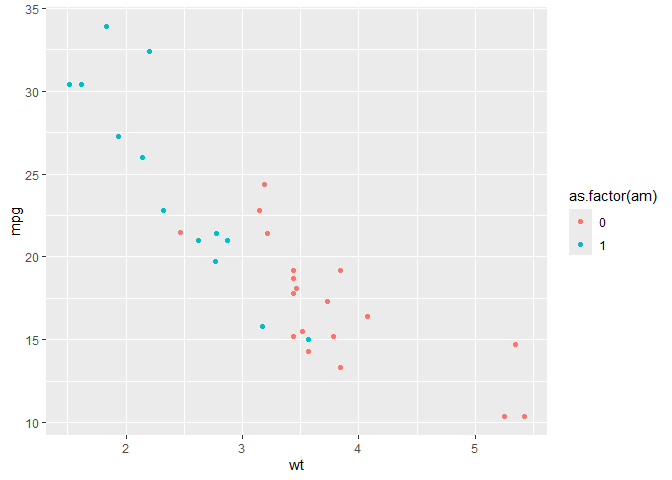
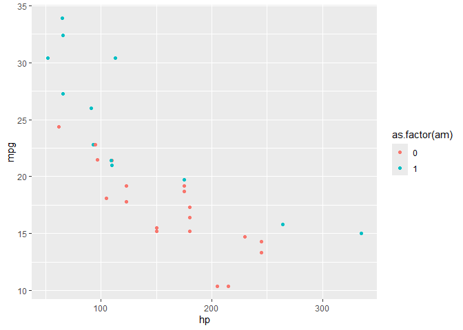

mtcars dataset: Rstudio practice analysis
================
Ong Jing Ying  
2026-01-02

In this data visualisation project, I will be performing basic
exploratory data analysis on the mtcars dataset from Rstudio’s default
datasets package.

The mtcars (Motor Trend Car Road Tests) dataset was extracted from the
1974 Motor Trends US magazine, 10 aspects of automobile design and
performance for 32 automobiles (1973–74 models). (11 columns x 32 rows).

## Step 1: Setting up my environment

loading the `ggplot2` & `dplyr` packages

``` r
library(ggplot2)
library(dplyr)
```

    ## 
    ## Attaching package: 'dplyr'

    ## The following objects are masked from 'package:stats':
    ## 
    ##     filter, lag

    ## The following objects are masked from 'package:base':
    ## 
    ##     intersect, setdiff, setequal, union

loading the `mtcars` dataset & getting a summary of it

``` r
data(mtcars)
str(mtcars)
```

    ## 'data.frame':    32 obs. of  11 variables:
    ##  $ mpg : num  21 21 22.8 21.4 18.7 18.1 14.3 24.4 22.8 19.2 ...
    ##  $ cyl : num  6 6 4 6 8 6 8 4 4 6 ...
    ##  $ disp: num  160 160 108 258 360 ...
    ##  $ hp  : num  110 110 93 110 175 105 245 62 95 123 ...
    ##  $ drat: num  3.9 3.9 3.85 3.08 3.15 2.76 3.21 3.69 3.92 3.92 ...
    ##  $ wt  : num  2.62 2.88 2.32 3.21 3.44 ...
    ##  $ qsec: num  16.5 17 18.6 19.4 17 ...
    ##  $ vs  : num  0 0 1 1 0 1 0 1 1 1 ...
    ##  $ am  : num  1 1 1 0 0 0 0 0 0 0 ...
    ##  $ gear: num  4 4 4 3 3 3 3 4 4 4 ...
    ##  $ carb: num  4 4 1 1 2 1 4 2 2 4 ...

the dataframe format is as follows:  
\[, 1\] mpg Miles/(US) gallon  
\[, 2\] cyl Number of cylinders  
\[, 3\] disp Displacement (cu.in.)  
\[, 4\] hp Gross horsepower  
\[, 5\] drat Rear axle ratio  
\[, 6\] wt Weight (1000 lbs)  
\[, 7\] qsec 1/4 mile time  
\[, 8\] vs Engine (0 = V-shaped, 1 = straight)  
\[, 9\] am Transmission (0 = automatic, 1 = manual)  
\[,10\] gear Number of forward gears  
\[,11\] carb Number of carburetors

you can preview the first 6 rows of the dataset with `head()` function

``` r
head(mtcars)
```

    ##                    mpg cyl disp  hp drat    wt  qsec vs am gear carb
    ## Mazda RX4         21.0   6  160 110 3.90 2.620 16.46  0  1    4    4
    ## Mazda RX4 Wag     21.0   6  160 110 3.90 2.875 17.02  0  1    4    4
    ## Datsun 710        22.8   4  108  93 3.85 2.320 18.61  1  1    4    1
    ## Hornet 4 Drive    21.4   6  258 110 3.08 3.215 19.44  1  0    3    1
    ## Hornet Sportabout 18.7   8  360 175 3.15 3.440 17.02  0  0    3    2
    ## Valiant           18.1   6  225 105 2.76 3.460 20.22  1  0    3    1

## Step 2: Answering basic questions

### Does fuel efficiency decrease with higher horsepower?

fuel efficiency is measured in mpg (Miles/gallon). as such, I will plot
mpg(miles per gallon) against hp(horsepower)

``` r
ggplot(data = mtcars) + geom_point(mapping = aes(x=hp, y=mpg))
```

<!-- -->

As expected, as horsepower increases, miles per gallon decreases because
more powerful engines would require more fuel to operate.

### The effect of weight on fuel efficiency

weight definitely negatively impacts fuel efficiency. But does weight or
horsepower affect it more?

``` r
ggplot(data = mtcars) + geom_point(mapping = aes(x=wt, y=mpg))
```

<!-- -->

### Which factor impacts fuel efficiency the most? horsepower (hp) or weight (wt)

In order to compare which variable negatively affects fuel efficiency
more, we can use the `cor()` function to calculate correlation
coefficient between the variables

``` r
cor(mtcars$wt, mtcars$mpg)
```

    ## [1] -0.8676594

``` r
cor(mtcars$hp, mtcars$mpg)
```

    ## [1] -0.7761684

From the calculated results, I can confirm that weight is the most
significant contributing factor to fuel efficiency (mpg) in automobiles

### Is manual more efficient than automatic?

this answer could be easily answered by comparing the average mpg of
automobiles by transmission type

``` r
avg_mpg <- mtcars %>% group_by(am) %>% 
  summarise(mpg = mean(mpg))
avg_mpg
```

    ## # A tibble: 2 × 2
    ##      am   mpg
    ##   <dbl> <dbl>
    ## 1     0  17.1
    ## 2     1  24.4

with 0= automatic and 1= manual, you could determine that manual cars
are generally more efficient from the result.

however, as stated before, horsepower & weight also affects fuel
efficiency of the cars. thus using the average to answer this question
would be unfair if the cars didn’t have exactly the same weight &
horsepower.

``` r
ggplot(data = mtcars) + geom_point(mapping = aes(x=wt, y=mpg, colour = as.factor(am)))
```

<!-- -->

``` r
ggplot(data = mtcars) + geom_point(mapping = aes(x=hp, y=mpg, colour = as.factor(am)))
```

<!-- -->

from the graphs, automatic cars in this dataset are mostly heavier &
have more powerful engines than the manual ones. This meant their
average mpg would naturally be lower as compared to the manual cars,
thus it is not possible to determine which transmission type has better
fuel efficiency just from comparing average mpg alone.

I believe that it is actually possible to compare fuel efficiency
between the two transmission types fairly by utilising linear regression
to compare both at the same horsepower & weight. However it is currently
beyond my skillset so my conclusion stops here.
